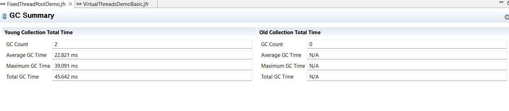
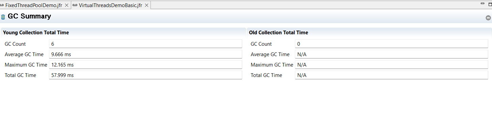
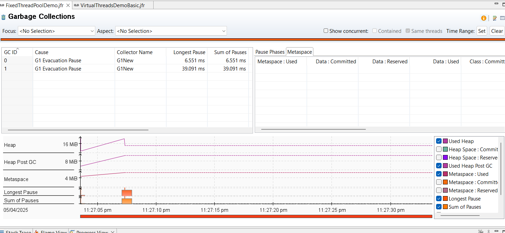
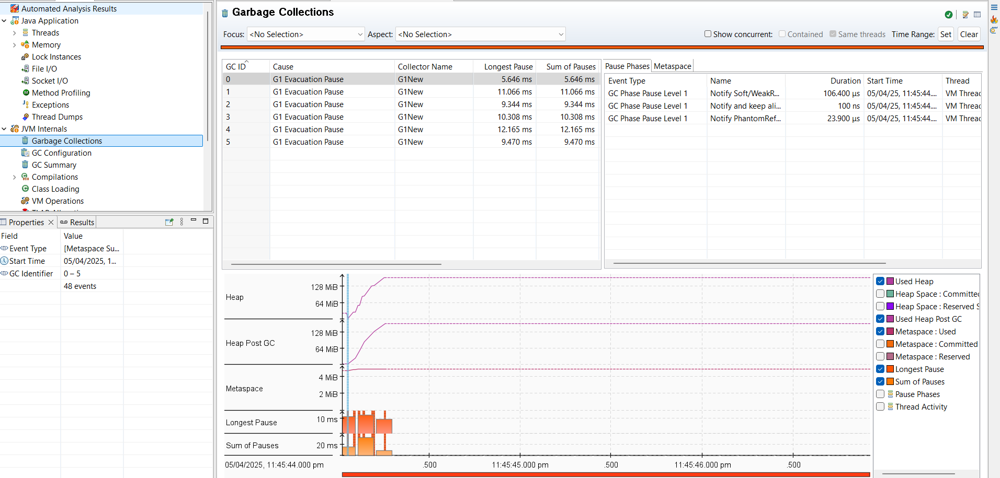
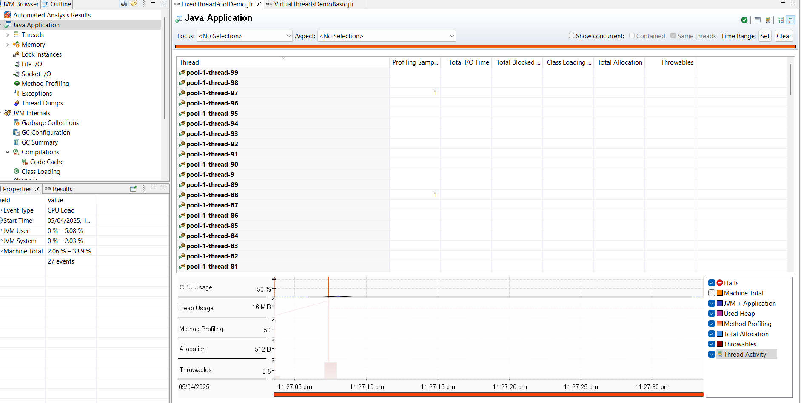
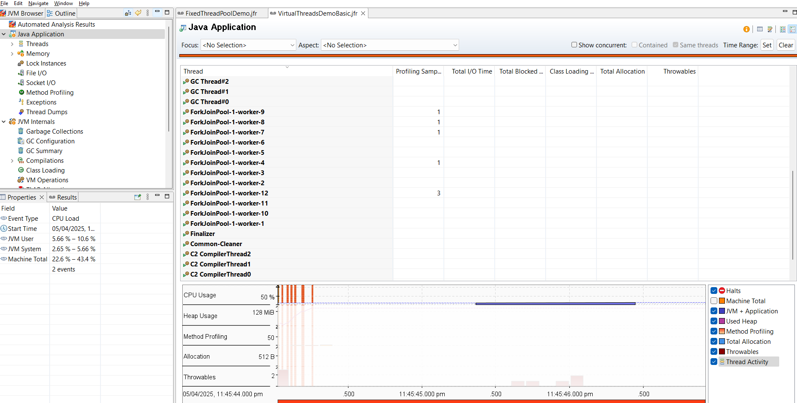
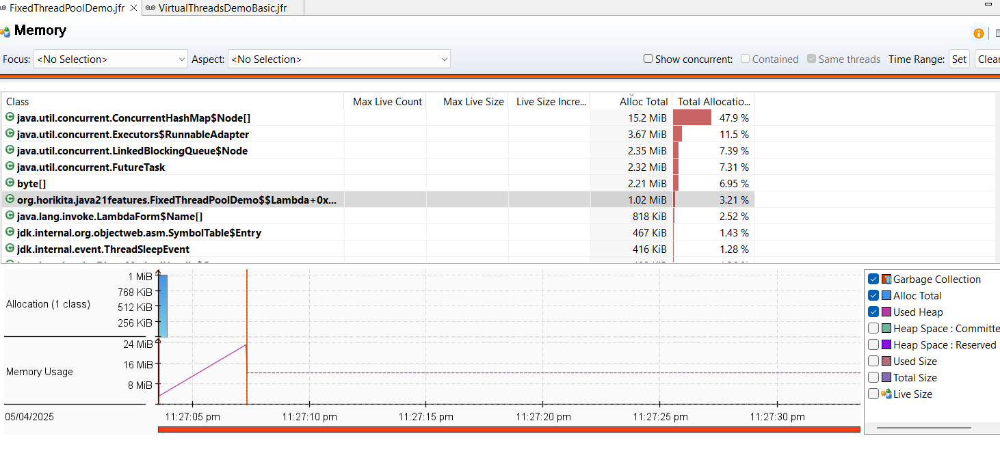
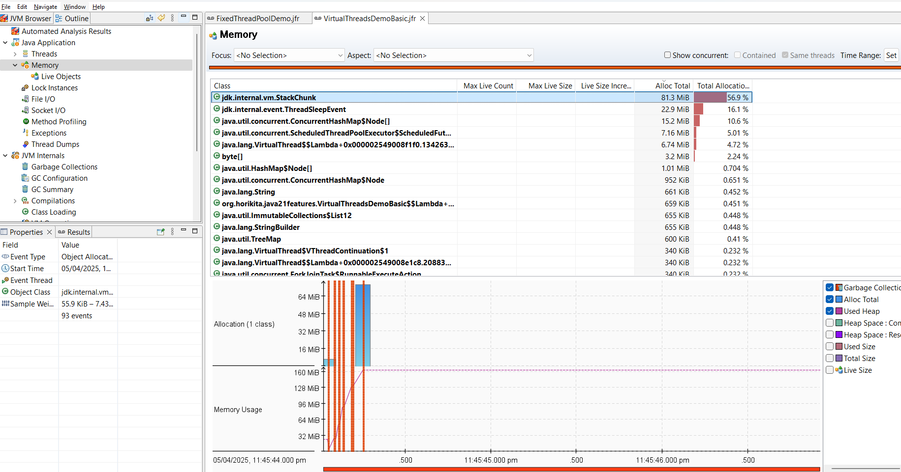

## FixedThreadPool GC Summary

## VirtualThreads GC Summary

## FixedThreadPool GC Details

## VirtualThreads GC Details

## FixedThreadPool CPU Usage

## VirtualThreads CPU Usage

## FixedThreadPool Memory Usage

## VirtualThreads Memory Usage
